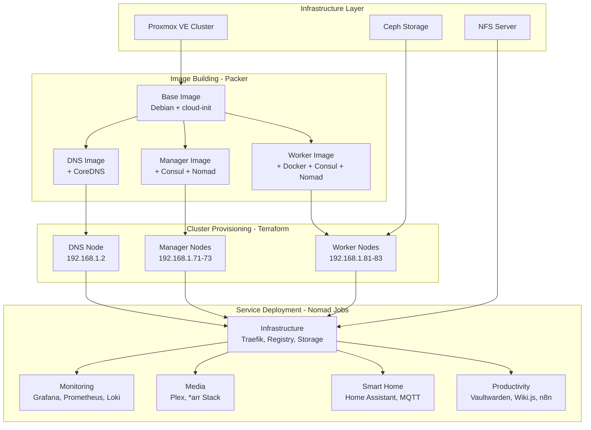
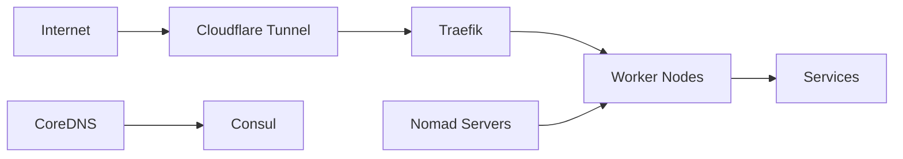

# Homelab Infrastructure

A production-ready homelab infrastructure built on Proxmox VE, leveraging HashiCorp Nomad for container orchestration, Consul for service discovery and configuration management, and CoreDNS for internal DNS resolution.

## Overview

This project automates the complete lifecycle of a homelab cluster—from building base OS images to deploying and managing containerized services. The infrastructure is designed with high availability, scalability, and infrastructure-as-code principles at its core.

## Architecture



### Technology Stack

| Layer | Technology | Purpose |
|-------|-----------|---------|
| **Virtualization** | Proxmox VE | VM management and orchestration |
| **Storage** | Ceph RBD + NFS | Distributed block storage + shared file storage |
| **Image Building** | Packer | Automated VM image creation |
| **Infrastructure** | Terraform | Cluster provisioning and configuration |
| **Orchestration** | HashiCorp Nomad | Container scheduling and deployment |
| **Service Discovery** | HashiCorp Consul | Service mesh and KV store |
| **DNS** | CoreDNS | Internal DNS resolution |
| **Networking** | Traefik | Reverse proxy and ingress controller |
| **Container Runtime** | Docker | Container execution |
| **Storage Plugin** | NFS CSI | Persistent volume management |

## Project Structure

```
homelab/
├── packer/                    # VM image templates
│   ├── base/                  # Base Debian image with cloud-init
│   ├── dns/                   # DNS server with CoreDNS
│   ├── manager/               # Consul + Nomad server nodes
│   └── worker/                # Docker + Consul + Nomad client nodes
├── terraform/
│   ├── cluster/               # Cluster infrastructure provisioning
│   │   ├── templates/         # Cloud-init configuration templates
│   │   └── README.md          # Cluster documentation
│   └── services/              # Service deployment
│       ├── nomad_jobs/        # Nomad job definitions
│       ├── consul_files/      # Consul KV configuration files
│       └── README.md          # Services documentation
└── Makefile                   # Automation scripts
```

## Prerequisites

### Infrastructure Requirements

- **Proxmox VE Cluster**: 3+ nodes recommended for HA
- **Ceph Storage Cluster**: RBD pool for VM disks, CephFS for configuration
- **NFS Server**: For CSI persistent volumes
- **Network**: Dedicated VLAN/subnet for cluster (default: 192.168.1.0/24)

### Software Requirements

- [Packer](https://www.packer.io/downloads) >= 1.8.0
- [Terraform](https://www.terraform.io/downloads) >= 1.0.0
- GNU Make
- SSH access to Proxmox nodes

### Access Requirements

- Proxmox VE API credentials with VM management permissions
- SSH key pair for VM access
- Nomad ACL token (if ACLs enabled)

## Quick Start

### 1. Configuration

Create configuration files from examples:

```bash
# Packer variables (image building)
cp packer/packer.pkrvars.hcl.example packer/packer.pkrvars.hcl
# Edit with your Proxmox credentials
```

```bash
# Terraform cluster variables
cp terraform/cluster/terraform.auto.tfvars.example terraform/cluster/terraform.auto.tfvars
# Edit with cluster configuration
```

```bash
# Terraform services variables
cp terraform/services/terraform.auto.tfvars.example terraform/services/terraform.auto.tfvars
# Edit with service configuration and secrets
```

### 2. Build VM Images

Build all required images with Packer:

```bash
# Build all images in sequence
make build-all

# Or build individually
make build-base      # Base Debian image
make build-dns       # DNS server image
make build-manager   # Manager node image
make build-worker    # Worker node image
```

Images are created as templates in Proxmox with IDs:
- Base: 9000
- DNS: 9001
- Manager: 9002
- Worker: 9003

### 3. Provision Cluster Infrastructure

Deploy the cluster VMs using Terraform:

```bash
# Initialize Terraform
make init-cluster

# Review planned changes
make plan-cluster

# Apply infrastructure
make deploy-cluster
```

This creates:
- 1 DNS node (192.168.1.2)
- 3 Manager nodes (192.168.1.71-73) - Consul + Nomad servers
- 3 Worker nodes (192.168.1.81-83) - Docker + Nomad clients

### 4. Deploy Services

Deploy containerized services with Nomad:

```bash
# Initialize Terraform
make init-services

# Review planned changes
make plan-services

# Deploy all services
make deploy-services
```

This deploys 40+ services including:
- Infrastructure: Traefik, Docker Registry, NFS CSI
- Monitoring: Grafana, Prometheus, InfluxDB, Loki
- Media: Plex, Jellyfin, Sonarr, Radarr, Prowlarr
- Smart Home: Home Assistant, Mosquitto (MQTT), Matter
- Productivity: Vaultwarden, Wiki.js, n8n

## Common Operations

### Managing Infrastructure

```bash
# Update cluster infrastructure
make plan-cluster
make deploy-cluster

# Update services
make plan-services
make deploy-services

# Format all Terraform and Nomad files
make format

# Validate Nomad job definitions
make validate-jobs
```

### Accessing Services

Services are accessible via Traefik reverse proxy:
- **Traefik Dashboard**: https://traefik.yourdomain.com
- **Nomad UI**: https://nomad.yourdomain.com
- **Consul UI**: https://consul.yourdomain.com
- **Grafana**: https://grafana.yourdomain.com

### Rebuilding Images

When updating Packer configurations:

```bash
# Rebuild specific image
make build-worker

# Then update VMs in Terraform
cd terraform/cluster && terraform taint 'proxmox_virtual_environment_vm.vm["worker01"]'
terraform apply
```

## Network Architecture



### IP Allocation

| Component | IP Range | Default Count |
|-----------|----------|---------------|
| DNS Node | 192.168.1.2 | 1 |
| Manager Nodes | 192.168.1.71-73 | 3 |
| Worker Nodes | 192.168.1.81-83 | 3 |

## Storage Architecture

### VM Storage (Ceph RBD)
- Manager nodes: 8 GB each
- Worker nodes: 30 GB each
- DNS node: 8 GB
- SSD emulation enabled with discard

### Persistent Storage (NFS CSI)
- Shared volumes for service data
- Multi-node-multi-writer access mode
- Automatic volume registration via Terraform

## Service Dependencies

Key service startup order:
1. **Storage**: storage-controller, storage-node
2. **Infrastructure**: docker-registry
3. **All other services** (depend on storage and registry)

## Documentation

- **Cluster Infrastructure**: See [`terraform/cluster/README.md`](terraform/cluster/README.md)
- **Service Deployment**: See [`terraform/services/README.md`](terraform/services/README.md)
- **Makefile Targets**: Run `make help` for available commands

## Troubleshooting

### Packer Builds Failing

```bash
# Enable debug logging
export PACKER_LOG=1
cd packer/base && packer build -var-file=../packer.pkrvars.hcl .
```

### Terraform Errors

```bash
# Reinitialize providers
make init-upgrade-cluster
make init-upgrade-services

# Check state
cd terraform/cluster && terraform state list
```

### Service Deployment Issues

```bash
# Validate job files
make validate-jobs

# Check Nomad logs
nomad job status <job-name>
nomad alloc logs <alloc-id>
```

### DNS Resolution Problems

Check CoreDNS is running:
```bash
ssh dns02
sudo systemctl status coredns
sudo journalctl -u coredns -f
```

## Security Considerations

- **Secrets Management**: Use `*.auto.tfvars` for secrets (gitignored)
- **SSH Keys**: Configure key-based authentication for all VMs
- **Network Isolation**: Use VLANs to isolate cluster traffic
- **Traefik Authentication**: Configure forward auth for protected services
- **Nomad ACLs**: Enable ACL system for production deployments
- **Consul ACLs**: Enable ACL system for production deployments

## Maintenance

### Backups

Critical data to backup:
- Terraform state files (`terraform.tfstate`)
- Packer variable files (`*.pkrvars.hcl`)
- Terraform variable files (`*.auto.tfvars`)
- NFS volumes (service persistent data)
- Consul KV store
- Nomad job definitions

### Updates

```bash
# Update Terraform providers
make init-upgrade-cluster
make init-upgrade-services

# Update service definitions
# Edit files in terraform/services/nomad_jobs/
make plan-services
make deploy-services
```

## License

See [`LICENSE`](LICENSE) file for details.

## Contributing

This is a personal homelab project, but feel free to use it as inspiration for your own infrastructure. Customize the configurations in:
- [`packer/variables.pkr.hcl`](packer/variables.pkr.hcl)
- [`terraform/cluster/variables.tf`](terraform/cluster/variables.tf)
- [`terraform/services/variables.tf`](terraform/services/variables.tf)
