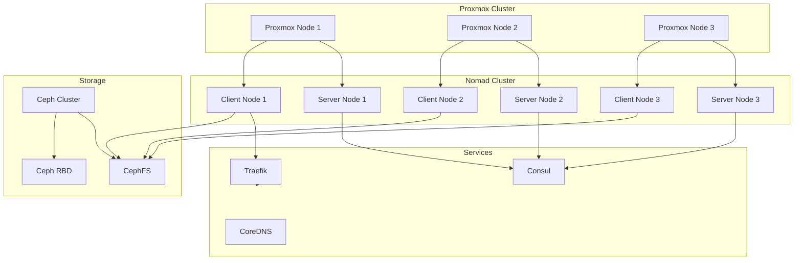

# Homelab Infrastructure Analysis & Recommendations

**Analysis Date:** December 20, 2025  
**Project:** Homelab Infrastructure (Nomad/Consul/Ceph Stack)

---

## Executive Summary

This homelab demonstrates a sophisticated infrastructure-as-code approach using Packer, Terraform, Nomad, and Consul. The project successfully orchestrates 40+ workloads across a 3-node Proxmox cluster with Ceph-backed storage. While the architecture is fundamentally sound, there are critical security concerns, maintainability issues, and opportunities for improvement.

### Infrastructure Overview



---

## 🔴 Critical Issues

### 1. **Hardcoded Secrets in Codebase**

**Severity:** CRITICAL  
**Location:** [`packer/client/scripts/provision.sh:41`](packer/client/scripts/provision.sh:41)

```bash
sudo echo "192.168.1.10,192.168.1.11,192.168.1.12:/ /mnt ceph name=admin,secret=AQD1yylngu+3IxAAFKhcBp9ufX6sZNDkLJxyHw==,fs=cephfs,relatime,_netdev 0 0" >> /etc/fstab
```

**Issue:** Ceph admin secret key is hardcoded and committed to version control.

**Recommendation:**
- Immediately rotate the Ceph admin secret
- Use Packer variables to inject secrets at build time
- Reference secrets from a secure vault (HashiCorp Vault, environment variables)
- Add `*.secret` patterns to [`.gitignore`](.gitignore:6) (already present, good!)

**Example Fix:**
```bash
# In provision.sh
sudo echo "192.168.1.10,192.168.1.11,192.168.1.12:/ /mnt ceph name=admin,secret=${CEPH_SECRET},fs=cephfs,relatime,_netdev 0 0" >> /etc/fstab

# In packer build
export CEPH_SECRET="$(vault read -field=secret secret/ceph/admin)"
```

---

### 2. **Overly Permissive Docker Configuration**

**Severity:** HIGH  
**Location:** [`packer/client/configs/nomad/client.hcl`](packer/client/configs/nomad/client.hcl)

**Issues:**
- Privileged mode enabled globally (line 9)
- ALL capabilities whitelisted (line 11)
- Raw exec driver enabled (line 12)
- Privileged containers allowed in plugin config (line 36)

**Recommendation:**
- Limit privileged mode to specific jobs that require it
- Whitelist only necessary capabilities per job
- Disable raw_exec unless absolutely required
- Implement least-privilege principle

**Example Fix:**
```hcl
client {
  enabled = true
  options = {
    # Only enable privileged for specific jobs
    "docker.privileged.enabled" = "false"
    "docker.volumes.enabled" = "true"
    # Whitelist only necessary caps
    "docker.caps.whitelist" = "CHOWN,DAC_OVERRIDE,FSETID,FOWNER,SETGID,SETUID,NET_BIND_SERVICE"
    # Disable unless needed
    "driver.raw_exec.enable" = "0"
  }
}
```

---

### 3. **Insecure Traefik Configuration**

**Severity:** MEDIUM-HIGH  
**Location:** [`terraform/consul/files/traefik/traefik.yaml`](terraform/consul/files/traefik/traefik.yaml)

**Issues:**
- `insecureSkipVerify: true` (line 40) - Disables TLS certificate validation
- Debug logging enabled in production (line 49)
- ProxyProtocol configuration commented out

**Recommendation:**
```yaml
serversTransport:
  insecureSkipVerify: false  # Enable cert validation
  rootCAs:
    - /etc/traefik/certs/ca.crt

log:
  level: info  # Change from debug to info/warn
  filePath: "/etc/traefik/logs/traefik.log"

# Enable if behind a proxy
entryPoints:
  websecure:
    proxyProtocol:
      trustedIPs:
        - 192.168.2.1
```

---

### 4. **Missing Backup Strategy Documentation**

**Severity:** MEDIUM  
**Issue:** No documented backup/disaster recovery procedures for:
- Ceph data
- Consul KV store (contains critical configs)
- Nomad state
- Application data

**Recommendation:**
- Document backup procedures in README
- Implement automated backups for Consul KV
- Create Ceph snapshot schedules
- Test disaster recovery procedures quarterly

---

## ⚠️ High Priority Improvements

### 5. **Hardcoded Cluster IDs and Domain Names**

**Severity:** MEDIUM  
**Locations:** All volume definitions in [`terraform/nomad/jobs.tf`](terraform/nomad/jobs.tf)

**Issue:** Ceph cluster ID `820b0f5c-cee3-40a7-b5d5-0aada0355612` is repeated 30+ times

**Recommendation:**
Create a centralized configuration:

```hcl
# In terraform/nomad/variables.tf
variable "ceph_cluster_id" {
  type        = string
  description = "Ceph cluster UUID"
  default     = "820b0f5c-cee3-40a7-b5d5-0aada0355612"
}

# In jobs.tf - use DRY principle
locals {
  ceph_volume_config = {
    cluster_id = var.ceph_cluster_id
    fs_name    = "cephfs"
  }
}

# In volume definitions
parameters = {
  clusterID = local.ceph_volume_config.cluster_id
  fsName    = local.ceph_volume_config.fs_name
}
```

---

### 6. **Inconsistent Volume Storage Patterns**

**Severity:** MEDIUM  
**Issue:** Mix of CSI volumes and host path mounts

**Examples:**
- [`docker-registry.hcl`](terraform/nomad/jobs/docker-registry.hcl:31) uses host path `/mnt/volumes/docker_registry`
- [`home-assistant.hcl`](terraform/nomad/jobs/home-assistant.hcl:36) uses host path `/mnt/volumes/hass`
- [`loki.hcl`](terraform/nomad/jobs/loki.hcl:36) uses host path `/mnt/volumes/loki`
- [`prometheus.hcl`](terraform/nomad/jobs/prometheus.hcl:35) uses host path `/mnt/volumes/prometheus`

But CSI volumes are defined for many of these services in [`jobs.tf`](terraform/nomad/jobs.tf)

**Recommendation:**
- Migrate all stateful workloads to CSI volumes for better portability
- Document which approach to use for new services
- Create migration plan for existing host-path services

---

### 7. **Duplicate Volume Definitions**

**Severity:** LOW-MEDIUM  
**Issue:** [`volumes.hcl`](terraform/nomad/volumes.hcl) appears to be a duplicate of volume definitions in [`jobs.tf`](terraform/nomad/jobs.tf)

**Recommendation:**
- Consolidate to single source of truth
- Remove duplicate file or document its purpose
- Consider using Terraform modules for volume definitions

---

### 8. **Home Assistant Configuration in Consul**

**Severity:** MEDIUM  
**Location:** [`terraform/consul/consul_keys.tf`](terraform/consul/consul_keys.tf:5-23)

**Issue:** References files in home directory `~/hass/` which are not in version control

**Recommendation:**
```hcl
# Move configs to repo
resource "consul_key_prefix" "hass" {
  path_prefix = "homelab/hass/"
  subkeys = {
    "automations.yaml"      = file("${path.module}/files/hass/automations.yaml"),
    "binary_sensors.yaml"   = file("${path.module}/files/hass/binary_sensors.yaml"),
    # ... etc
  }
}
```

Then store sanitized configs in `terraform/consul/files/hass/` directory.

---

## 📊 Code Organization & Maintainability

### 9. **Large Monolithic Files**

**Issue:** [`terraform/nomad/jobs.tf`](terraform/nomad/jobs.tf) is 971 lines with mixed job and volume definitions

**Recommendation:**
Restructure for better maintainability:

```
terraform/nomad/
├── jobs/
│   ├── jobs.tf          # Job resource declarations
│   └── *.hcl            # Job specifications (already present)
├── volumes/
│   ├── volumes.tf       # Volume declarations
│   └── variables.tf     # Volume-specific variables
└── main.tf              # Module orchestration
```

---

### 10. **Commented Code Should Be Removed**

**Locations:**
- [`jobs.tf:121-123`](terraform/nomad/jobs.tf:121) - Ollama job commented out
- [`jobs.tf:206-208`](terraform/nomad/jobs.tf:206) - Windmill job commented out
- [`volumes.hcl:366-416`](terraform/nomad/volumes.hcl:366) - Multiple commented volume definitions

**Recommendation:**
- Git tracks history, remove commented code
- If jobs are experimental, move to separate `experimental/` directory
- Document why services are disabled in README

---

### 11. **Inconsistent Naming Conventions**

**Issue:**
- Job file: `docker-registry.hcl` (hyphenated)
- Job name: `docker-registry` (hyphenated)
- Volume: `docker-registry` (hyphenated)
- But also: `home-assistant` vs `hass` (job name aliases)

**Recommendation:**
- Establish naming convention in CONTRIBUTING.md
- Use consistent pattern: `service-name` for files, volumes, and job names

---

## 🔒 Security Recommendations

### 12. **Implement Secret Management**

**Current State:** Secrets passed as Terraform variables

**Recommendation:**
Integrate HashiCorp Vault:

```hcl
# Example Nomad job with Vault integration
task "app" {
  vault {
    policies = ["app-policy"]
  }
  
  template {
    data = <<EOF
{{ with secret "secret/data/app/config" }}
DATABASE_URL={{ .Data.data.db_url }}
{{ end }}
EOF
    destination = "secrets/config.env"
    env         = true
  }
}
```

---

### 13. **Telemetry is Disabled**

**Location:** [`packer/client/configs/nomad/client.hcl:24-30`](packer/client/configs/nomad/client.hcl:24)

**Recommendation:**
Enable telemetry for better observability:

```hcl
telemetry {
  collection_interval = "10s"
  disable_hostname = false
  prometheus_metrics = true
  publish_allocation_metrics = true
  publish_node_metrics = true
}
```

---

### 14. **Selective Host Networking Usage**

**Status:** ✅ Generally Good

**Observation:** Only 13 out of 40+ services use `network_mode = "host"`, and these are services with legitimate requirements:
- [`traefik.hcl`](terraform/nomad/jobs/traefik.hcl) - Requires direct access to ports 80/443
- [`home-assistant.hcl`](terraform/nomad/jobs/home-assistant.hcl) - Needs network access for IoT device discovery
- [`plex.hcl`](terraform/nomad/jobs/plex.hcl) - DLNA and network discovery
- Database/Infrastructure services (intentional for direct access)

**Recommendation:**
- Current approach is appropriate for homelab requirements
- Consider documenting in README which services require host networking and why

---

## 🚀 Scalability & Reliability

### 15. **Resource Quotas Not Defined**

**Severity:** LOW (Optional for homelab)

**Issue:** No namespace quotas or resource limits at cluster level

**Recommendation:**
For homelab use, resource quotas are optional. However, if you want to prevent runaway resource usage:

```hcl
resource "nomad_quota" "homelab" {
  name = "homelab-quota"
  
  limit {
    region = "global"
    region_limit {
      cpu = 10000
      memory = 20000
    }
  }
}
```

---

### 16. **Single DNS Server Instance**

**Severity:** LOW (Acceptable for homelab)

**Location:** [`terraform/cluster/modules.tf:59-82`](terraform/cluster/modules.tf:59)

**Observation:** Only 1 DNS server deployed (`count = 1`)

**Note:** For a homelab, a single DNS instance is perfectly reasonable. The upstream ISP DNS provides fallback capability. Consider a second instance only if DNS downtime significantly impacts your workflow.

---

### 17. **Single Instance Monitoring Services**

**Severity:** LOW (Appropriate for homelab)

**Observation:** Prometheus, Loki, and other monitoring services run as single instances with `single-node-writer` volumes

**Note:** For homelab purposes, single instances are appropriate. HA monitoring (Thanos, Loki distributed mode) would be overkill unless you're specifically learning those technologies. Data loss during restarts is acceptable for non-production metrics.

---

### 18. **Lifecycle Policy Too Strict**

**Location:** [`terraform/vm/resources.tf:56-58`](terraform/vm/resources.tf:56)

**Issue:**
```hcl
lifecycle {
  ignore_changes = all
}
```

**Recommendation:**
```hcl
lifecycle {
  ignore_changes = [
    clone,
    disk,
    network,
  ]
}
```

This allows Terraform to detect and update configuration changes while ignoring immutable attributes.

---

## 🏗️ Architecture Improvements

### 19. **Centralize Job Dependencies**

**Current State:** Dependencies scattered throughout [`jobs.tf`](terraform/nomad/jobs.tf)

**Recommendation:**
Create dependency graph visualization and centralize:

```hcl
locals {
  base_jobs = [
    nomad_job.docker-registry,
    nomad_job.traefik,
    nomad_job.consul,
  ]
  
  database_jobs = [
    nomad_job.postgres,
    nomad_job.mongo,
    nomad_job.influxdb,
  ]
}

resource "nomad_job" "app" {
  depends_on = concat(local.base_jobs, local.database_jobs)
}
```

---

### 20. **Implement GitOps Workflow**

**Recommendation:**
- Set up CI/CD pipeline for validation
- Use the existing [`validate-jobs.sh`](terraform/scripts/validate-jobs.sh) in CI
- Auto-format on commit with pre-commit hooks
- Implement progressive deployment (canary/blue-green)

**Example `.gitlab-ci.yml`:**
```yaml
stages:
  - validate
  - plan
  - apply

validate:
  script:
    - terraform fmt -check -recursive
    - ./terraform/scripts/validate-jobs.sh
    - terraform validate

plan:
  script:
    - terraform plan -out=tfplan
  artifacts:
    paths:
      - tfplan
```

---

### 21. **Optimize Health Check Implementation**

**Issue:** Many web applications use TCP checks instead of HTTP checks, which provide better application health validation

**Examples where HTTP checks would be better:**

**Current approach (TCP check):**
```hcl
# sonarr.hcl
check {
  type     = "tcp"
  port     = "http"
  interval = "10s"
  timeout  = "2s"
}
```

**Recommended approach (HTTP check):**
```hcl
check {
  type     = "http"
  path     = "/ping"  # Sonarr, Radarr, Prowlarr expose this
  interval = "10s"
  timeout  = "3s"
}
```

**Why HTTP is better:** TCP checks only verify the port is open. HTTP checks validate the application responds correctly with a 200 status code, detecting issues like crashed processes that still have open sockets.

**Web applications that should use HTTP checks:**
- [`sonarr.hcl`](terraform/nomad/jobs/sonarr.hcl:22) - Has `/ping` endpoint
- [`radarr.hcl`](terraform/nomad/jobs/radarr.hcl) - Has `/ping` endpoint
- [`prowlarr.hcl`](terraform/nomad/jobs/prowlarr.hcl) - Has `/ping` endpoint
- [`influxdb.hcl`](terraform/nomad/jobs/influxdb.hcl:19) - Has `/health` endpoint
- [`vaultwarden.hcl`](terraform/nomad/jobs/vaultwarden.hcl:20) - Web application
- [`jellyfin.hcl`](terraform/nomad/jobs/jellyfin.hcl:19) - Has `/health` endpoint

**Services correctly using TCP checks:**
- [`postgres.hcl`](terraform/nomad/jobs/postgres.hcl) - Database without HTTP interface ✅
- [`mosquitto.hcl`](terraform/nomad/jobs/mosquitto.hcl) - MQTT broker (not HTTP) ✅
- [`samba.hcl`](terraform/nomad/jobs/samba.hcl) - File sharing (not HTTP) ✅
- [`loki.hcl`](terraform/nomad/jobs/loki.hcl) - Internal service, TCP is sufficient ✅

**Low Priority:** This is an optimization, not a critical issue. Current TCP checks work fine for basic availability monitoring.

---

## 📈 Monitoring & Observability Enhancements

### 22. **Implement Centralized Logging**

**Current State:** 
- Loki deployed (good!)
- Vector deployed (good!)
- But no unified logging strategy documented

**Recommendation:**
- Document log aggregation flow
- Ensure all jobs send logs to Loki via Vector
- Create log retention policies
- Set up log-based alerting

---

### 23. **Add Alerting Layer**

**Missing:** AlertManager or equivalent

**Recommendation:**
```yaml
# Add to Prometheus config
alerting:
  alertmanagers:
    - static_configs:
        - targets:
            - alertmanager:9093

rule_files:
  - /etc/prometheus/alerts/*.yml
```

Deploy AlertManager as Nomad job and configure notification channels (email, Slack, PagerDuty).

---

### 24. **Create Grafana Dashboards Repository**

**Recommendation:**
- Store Grafana dashboard JSONs in `terraform/consul/files/grafana/dashboards/`
- Use Grafana provisioning to auto-import dashboards
- Version control dashboard changes

---

## 🛠️ Operational Improvements

### 25. **Document Upgrade Procedures**

**Missing:** Version upgrade strategy for:
- Nomad cluster
- Consul cluster
- Individual services
- Packer images

**Recommendation:**
Create `docs/UPGRADES.md` with:
- Compatibility matrices
- Rollback procedures
- Testing checklist
- Upgrade order (databases first, then apps)

---

### 26. **Implement Image Tagging Strategy**

**Issue:** Mix of version tags and `latest`

**Examples:**
- Traefik: `traefik:3.6.1` ✅ (good - pinned version)
- Prometheus: `prom/prometheus` ❌ (defaults to latest)
- Many others without versions

**Recommendation:**
- Always use explicit version tags
- Document image update policy
- Use Renovate or Dependabot for automated updates

---

### 27. **Add Makefile Improvements**

**Current [`Makefile`](Makefile) is good, but could add:**

```makefile
.PHONY: backup
backup:##................Backup Consul KV and Nomad state
	consul kv export > backup/consul-$(shell date +%Y%m%d).json
	nomad operator snapshot save backup/nomad-$(shell date +%Y%m%d).snap

.PHONY: test
test:##..................Run all tests
	@echo "Running Terraform validation..."
	cd terraform/cluster && terraform validate
	cd terraform/services && terraform validate
	@echo "Running job validation..."
	./terraform/scripts/validate-jobs.sh

.PHONY: security-scan
security-scan:##.........Scan for security issues
	trivy config terraform/
	checkov -d terraform/
```

---

## 📝 Documentation Improvements

### 28. **Enhance README.md**

**Current [`README.md`](README.md) is minimal**

**Add:**
- Architecture diagram
- Prerequisites and dependencies
- Quick start guide
- Troubleshooting section
- Contributing guidelines
- FAQ

---

### 29. **Create Architecture Decision Records (ADRs)**

**Recommendation:**
Document key decisions in `docs/adr/`:
- Why Nomad over Kubernetes?
- Why Ceph over GlusterFS?
- Storage strategy evolution
- Network architecture choices

**Template:**
```markdown
# ADR-001: Migration from Gluster to Ceph

## Status
Accepted

## Context
[Why the decision was needed]

## Decision
[What was decided]

## Consequences
[Impact of the decision]
```

---

### 30. **Document Network Topology**

**Missing:** Network diagram showing:
- VLANs and subnets
- Firewall rules
- Port mappings
- DNS resolution flow

---

## 🎯 Quick Wins (Low Effort, High Impact)

### Priority Actions (Do These First)

1. **Rotate hardcoded Ceph secret** - 30 minutes
2. **Enable Nomad telemetry** - 15 minutes  
3. **Remove commented code** - 30 minutes
4. **Create backup of Consul KV** - 15 minutes
5. **Pin all Docker image versions** - 1 hour
6. **Change Traefik log level from debug to info** - 5 minutes
7. **Add `.terraform/` to gitignore** (already done ✅)

---

## 📊 Metrics & Success Indicators

### Current State Assessment

| Category | Score | Status |
|----------|-------|--------|
| Security | 6/10 | ⚠️ Needs Improvement |
| Reliability | 7/10 | ✅ Good |
| Maintainability | 7/10 | ✅ Good |
| Scalability | 8/10 | ✅ Good |
| Documentation | 4/10 | ⚠️ Needs Improvement |
| Observability | 6/10 | ⚠️ Needs Improvement |

### Target State (6 Months)

| Category | Target | Actions |
|----------|--------|---------|
| Security | 9/10 | Secrets mgmt, least privilege, TLS |
| Reliability | 9/10 | HA DNS, backups, disaster recovery |
| Maintainability | 8/10 | Better docs, modular code |
| Scalability | 9/10 | Resource quotas, auto-scaling ready |
| Documentation | 8/10 | ADRs, runbooks, diagrams |
| Observability | 8/10 | Alerting, dashboards, tracing |

---

## 🎓 Best Practices Violations

### Terraform

1. ❌ Hardcoded values instead of variables (Ceph cluster ID)
2. ❌ Large monolithic files (jobs.tf - 971 lines)
3. ❌ Missing output values for important resources
4. ✅ Good use of `.gitignore` for sensitive files
5. ✅ Proper use of `prevent_destroy` lifecycle

### Nomad

1. ⚠️ Inconsistent job type usage (minor)
2. ⚠️ Missing resource quotas (acceptable for homelab)
3. ✅ Appropriate use of `network_mode = "host"` where needed
4. ✅ Good use of health checks
5. ✅ Proper service discovery via Consul
6. ✅ Most services use bridge networking appropriately

### Consul

1. ❌ External file references outside repo
2. ✅ Good separation of config files
3. ✅ Proper use of KV for configuration

### Packer

1. ❌ Hardcoded secrets in provisioning scripts
2. ✅ Good image naming convention
3. ✅ Proper separation of base and specialized images

---

## 🔄 Migration Paths

### Short Term (1-3 Months)

- Fix security issues
- Improve documentation
- Implement backup strategy
- Enable monitoring/alerting

### Medium Term (3-6 Months)

- Refactor Terraform structure
- Implement secret management
- Deploy HA for critical services
- Create disaster recovery procedures

### Long Term (6-12 Months)

- Consider Consul Connect service mesh
- Evaluate Nomad Pack for app deployment
- Implement multi-region support
- Advanced observability (tracing, APM)

---

## 🌟 What's Working Well

### Strengths to Maintain

1. ✅ **Infrastructure as Code** - Everything is version controlled
2. ✅ **Ceph Storage** - Modern, scalable storage solution
3. ✅ **Makefile Usage** - Great automation with make targets
4. ✅ **Job Validation** - Script to validate all jobs before apply
5. ✅ **Traefik Integration** - Automatic routing and SSL
6. ✅ **Service Discovery** - Consul catalog integration
7. ✅ **Comprehensive Workload Coverage** - 40+ services orchestrated
8. ✅ **Modular Packer Images** - Base + specialized layers
9. ✅ **Prevent Destroy on Volumes** - Data protection
10. ✅ **Spread Scheduling** - Better resource distribution

---

## 📚 Recommended Reading

- [Nomad Best Practices](https://developer.hashicorp.com/nomad/tutorials/best-practices)
- [Consul Production Checklist](https://developer.hashicorp.com/consul/tutorials/production-deploy)
- [Terraform Best Practices](https://www.terraform-best-practices.com/)
- [Ceph Best Practices](https://docs.ceph.com/en/latest/rados/operations/)
- [Traefik Security](https://doc.traefik.io/traefik/https/overview/)

---

## 🤝 Getting Help

**Community Resources:**
- HashiCorp Discuss Forum
- r/homelab on Reddit
- Nomad Slack/Discord
- Ceph Mailing Lists

---

## Conclusion

This homelab project demonstrates sophisticated infrastructure engineering with modern tooling. The foundation is solid, but addressing the security vulnerabilities and improving documentation should be immediate priorities. The infrastructure is well-positioned for growth and can serve as a learning platform for cloud-native technologies.

**Overall Assessment:** 7/10 - Strong foundation with room for improvement

**Recommended Next Steps:**

1. Address critical security issues (secrets, permissions)
2. Implement backup and disaster recovery procedures
3. Enhance documentation with architecture diagrams
4. Refactor Terraform for better maintainability
5. Add comprehensive monitoring and alerting
6. Establish operational runbooks and procedures

The investment in automation and infrastructure-as-code will pay dividends as the homelab grows. Focus on security hardening and reliability improvements for production-grade stability.
