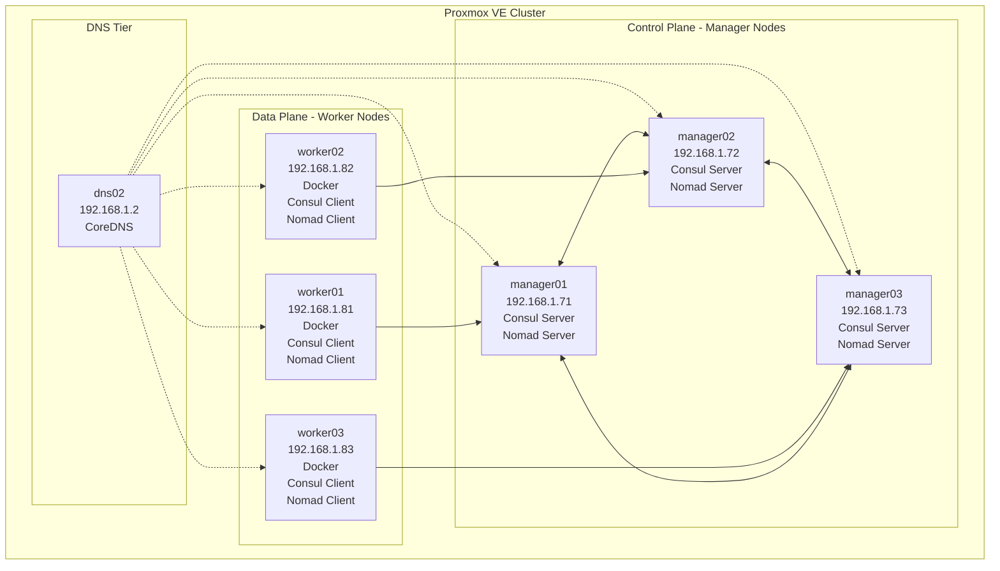
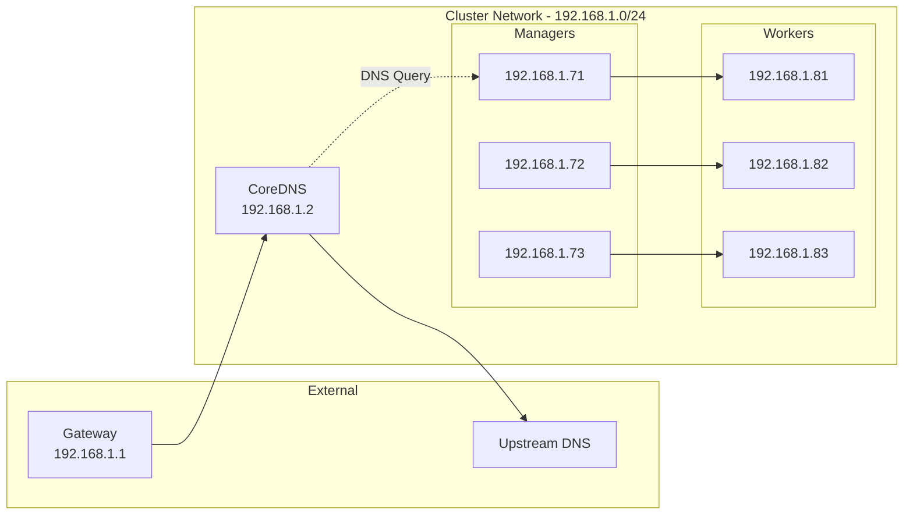

# Cluster Infrastructure

This Terraform module provisions the core cluster infrastructure on Proxmox VE, including DNS, Consul server nodes, and Nomad worker nodes. It creates VMs from Packer-built templates and configures them via cloud-init.

## Overview

The cluster infrastructure consists of three node types:

- **DNS Node**: CoreDNS server for internal DNS resolution and service discovery
- **Manager Nodes**: Consul + Nomad servers for cluster coordination (HA configuration)
- **Worker Nodes**: Docker + Consul + Nomad clients for running containerized workloads

## Architecture



## Components

### DNS Node

**Purpose**: Provides DNS resolution for the cluster using CoreDNS.

**Configuration**:
- **Template**: `dns-tpl` (Template ID: 9001)
- **Default IP**: 192.168.1.2
- **Resources**: 2 CPU cores, 2 GB RAM, 8 GB disk
- **Services**: CoreDNS with Consul integration
- **Nameserver**: 127.0.0.1 (self-referential)

**Cloud-init Templates**:
- [`templates/corefile.tpl`](templates/corefile.tpl) - CoreDNS configuration
- [`templates/coredns_service.tpl`](templates/coredns_service.tpl) - Systemd service configuration
- [`templates/dns_zone_file.tpl`](templates/dns_zone_file.tpl) - DNS zone file

### Manager Nodes

**Purpose**: Run Consul and Nomad in server mode for cluster coordination and scheduling.

**Configuration**:
- **Template**: `manager-tpl` (Template ID: 9002)
- **Default IPs**: 192.168.1.71-73
- **Default Count**: 3 (for HA quorum)
- **Resources**: 4 CPU cores, 8 GB RAM, 8 GB disk each
- **Services**: Consul server, Nomad server

**Cloud-init Templates**:
- [`templates/consul_manager.tpl`](templates/consul_manager.tpl) - Consul server configuration
- [`templates/nomad_manager.tpl`](templates/nomad_manager.tpl) - Nomad server configuration

**High Availability**:
- Consul: 3-node quorum for leader election
- Nomad: 3-node quorum for scheduling decisions
- Automatic leader election on failure

### Worker Nodes

**Purpose**: Run containerized workloads via Docker, managed by Nomad.

**Configuration**:
- **Template**: `worker-tpl` (Template ID: 9003)
- **Default IPs**: 192.168.1.81-83
- **Default Count**: 3
- **Resources**: 12 CPU cores, 64 GB RAM, 30 GB disk each
- **Services**: Docker, Consul client, Nomad client
- **Users**: `containers` (UID 1000), `media` (UID 1010)

**Cloud-init Templates**:
- [`templates/consul_worker.tpl`](templates/consul_worker.tpl) - Consul client configuration
- [`templates/nomad_worker.tpl`](templates/nomad_worker.tpl) - Nomad client configuration

## Prerequisites

### Required Packer Images

Before running this Terraform module, you must build the required VM templates:

```bash
# Build all images
cd ../../
make build-all

# Or build individually
make build-dns
make build-manager
make build-worker
```

Verify templates exist in Proxmox with IDs: 9001 (dns), 9002 (manager), 9003 (worker)

### Proxmox Configuration

- **Storage**: 
  - Block storage (default: `rbd` - Ceph RBD)
  - Config storage (default: `cephfs` - CephFS)
- **Network**: Bridge configured (default: `vmbr2`)
- **API Access**: User with VM management permissions

### Network Requirements

- **Subnet**: Configured CIDR (default: 192.168.1.0/24)
- **Gateway**: First usable IP (default: 192.168.1.1)
- **DNS**: Upstream DNS for managers/workers
- **VLAN**: Optional VLAN tagging support

## Configuration

### Required Variables

Create a `terraform.auto.tfvars` file with the following required variables:

```hcl
# Proxmox API Configuration
proxmox_url      = "https://proxmox.example.com:8006/api2/json"
proxmox_user     = "terraform@pve"
proxmox_password = "your-api-password"

# Cloud-init User Configuration
ciuser     = "admin"
cipassword = "secure-password"
sshkeys    = "ssh-rsa AAAAB3... your-public-key"

# Network Configuration
nameserver    = "192.168.1.1"         # Upstream DNS
searchdomain  = "example.local"
domain        = "example.com"         # Domain for services

# Cluster Configuration
datacenter = "dc1"                     # Nomad datacenter name
```

### Optional Variables

Customize cluster size and resources in [`variables.tf`](variables.tf):

```hcl
# Node Counts
manager_count = 3    # Default: 3 (HA quorum)
worker_count  = 3    # Default: 3 (scale as needed)

# Network
cluster_cidr = "192.168.1.0/24"
bridge       = "vmbr2"
vlan_tag     = ""    # Optional VLAN tag

# Storage
storage        = "rbd"     # VM disk storage pool
config_storage = "cephfs"  # Configuration storage

# Proxmox Nodes
pve_nodes = ["pve01", "pve02", "pve03"]
```

### IP Address Allocation

IP addresses are automatically calculated from `cluster_cidr`:

| Node Type | Offset | Default IPs | Formula |
|-----------|--------|-------------|---------|
| DNS Node | 2 | 192.168.1.2 | `cidrhost(cluster_cidr, 2)` |
| Managers | 71+ | 192.168.1.71-73 | `cidrhost(cluster_cidr, 71+i)` |
| Workers | 81+ | 192.168.1.81-83 | `cidrhost(cluster_cidr, 81+i)` |

Defined in [`locals.tf`](locals.tf).

## Usage

### Initialize Terraform

```bash
# From project root
make init-cluster

# Or manually
cd terraform/cluster
terraform init
```

This downloads the required providers:
- `bpg/proxmox` v0.93.0

### Plan Changes

```bash
# From project root
make plan-cluster

# Or manually
cd terraform/cluster
terraform plan
```

Review the planned changes carefully, especially:
- VM names and IP addresses
- Resource allocations
- Cloud-init configurations

### Apply Infrastructure

```bash
# From project root
make deploy-cluster

# Or manually (with confirmation)
cd terraform/cluster
terraform apply
```

This creates:
- 1 DNS node
- 3 Manager nodes (Consul + Nomad servers)
- 3 Worker nodes (Docker + Nomad clients)

Deployment takes 5-10 minutes depending on Proxmox cluster performance.

### Verify Deployment

After deployment, verify cluster health:

```bash
# SSH into a manager node
ssh admin@192.168.1.71

# Check Consul cluster
consul members

# Expected output:
# Node        Address             Status  Type    Build   Protocol  DC   Partition  Segment
# manager01   192.168.1.71:8301   alive   server  1.x.x   2         dc1  default    <all>
# manager02   192.168.1.72:8301   alive   server  1.x.x   2         dc1  default    <all>
# manager03   192.168.1.73:8301   alive   server  1.x.x   2         dc1  default    <all>
# worker01    192.168.1.81:8301   alive   client  1.x.x   2         dc1  default    <default>
# worker02    192.168.1.82:8301   alive   client  1.x.x   2         dc1  default    <default>
# worker03    192.168.1.83:8301   alive   client  1.x.x   2         dc1  default    <default>

# Check Nomad cluster
nomad server members  # On manager node
nomad node status     # List all nodes

# Expected output:
# ID        DC   Name       Class   Drain  Eligibility  Status
# xxxxx...  dc1  worker01   <none>  false  eligible     ready
# xxxxx...  dc1  worker02   <none>  false  eligible     ready
# xxxxx...  dc1  worker03   <none>  false  eligible     ready
```

## File Structure

```
terraform/cluster/
├── cloud_init.tf          # Cloud-init configuration files
├── locals.tf              # IP allocation and node definitions
├── provider.tf            # Terraform and Proxmox provider config
├── proxmox_vm.tf          # VM resource definitions
├── variables.tf           # Input variable definitions
├── templates/             # Cloud-init templates
│   ├── consul_manager.tpl # Consul server config
│   ├── consul_worker.tpl  # Consul client config
│   ├── nomad_manager.tpl  # Nomad server config
│   ├── nomad_worker.tpl   # Nomad client config
│   ├── corefile.tpl       # CoreDNS config
│   ├── coredns_service.tpl # CoreDNS systemd service
│   └── dns_zone_file.tpl  # DNS zone file
└── README.md              # This file
```

## Cloud-init Configuration

### Consul Configuration

**Manager Nodes** ([`templates/consul_manager.tpl`](templates/consul_manager.tpl)):
- Server mode with bootstrap expect = 3
- Bind to node's IP address
- Retry join on all manager IPs
- UI enabled
- Auto-encrypt enabled

**Worker Nodes** ([`templates/consul_worker.tpl`](templates/consul_worker.tpl)):
- Client mode
- Retry join on all manager IPs
- Auto-encrypt enabled

### Nomad Configuration

**Manager Nodes** ([`templates/nomad_manager.tpl`](templates/nomad_manager.tpl)):
- Server mode with bootstrap expect = 3
- Bind to node's IP address
- Retry join on all manager IPs
- Default datacenter: dc1

**Worker Nodes** ([`templates/nomad_worker.tpl`](templates/nomad_worker.tpl)):
- Client mode
- Docker driver enabled
- Network mode: bridge
- Servers: all manager IPs
- Host volumes configured

### CoreDNS Configuration

**DNS Node** ([`templates/corefile.tpl`](templates/corefile.tpl)):
- Forward zone for Consul (`.consul` domain)
- Custom zone file for cluster domain
- Upstream DNS forwarding
- Logging enabled

## Network Architecture



## Storage Configuration

### VM Disks

All VMs use Ceph RBD for block storage:
- **Interface**: SCSI (scsi0)
- **IO Thread**: Enabled
- **Discard**: Enabled
- **SSD Emulation**: Enabled
- **Storage Pool**: Configurable via `storage` variable

### Configuration Data

Cloud-init ISO images stored in CephFS:
- **Storage Pool**: Configurable via `config_storage` variable
- **Interface**: IDE (ide0)

## Scaling

### Adding Worker Nodes

To scale worker nodes:

1. Update `terraform.auto.tfvars`:
```hcl
worker_count = 5  # Increase from 3 to 5
```

2. Apply changes:
```bash
make plan-cluster
make deploy-cluster
```

New workers will be assigned IPs: 192.168.1.84, 192.168.1.85

### Adding Manager Nodes

Manager count should remain at 3 for optimal Raft consensus. Scaling to 5 or 7 is possible but requires careful consideration of failure domains.

## Lifecycle Management

### Ignore Changes

VMs have `lifecycle { ignore_changes = all }` configured in [`proxmox_vm.tf`](proxmox_vm.tf). This prevents Terraform from modifying VMs after initial creation.

**Rationale**: VMs are immutable infrastructure. Updates should be done via Packer image rebuilds.

### Rebuilding Nodes

To update a node:

1. Build new Packer image
2. Taint the VM resource:
```bash
cd terraform/cluster
terraform taint 'proxmox_virtual_environment_vm.vm["worker01"]'
```

3. Apply to recreate:
```bash
terraform apply
```

### Destroying Infrastructure

```bash
# Destroy all resources
cd terraform/cluster
terraform destroy

# Destroy specific node
terraform destroy -target='proxmox_virtual_environment_vm.vm["worker01"]'
```

**Warning**: This removes all VMs and cloud-init configurations. Ensure services are stopped and data is backed up.

## Troubleshooting

### VMs Won't Start

**Symptom**: Terraform apply succeeds but VMs don't boot.

**Check**:
```bash
# On Proxmox host
qm list | grep -E "(dns|manager|worker)"
journalctl -u pve-cluster -f
```

**Common Causes**:
- Template doesn't exist (verify template IDs)
- Storage pool unavailable
- Insufficient resources on Proxmox node

### Cloud-init Not Running

**Symptom**: VMs boot but don't get configured.

**Check**:
```bash
# SSH into VM (may need Proxmox console)
sudo cloud-init status
sudo cloud-init status --long

# View cloud-init logs
sudo cat /var/log/cloud-init.log
sudo cat /var/log/cloud-init-output.log
```

**Common Causes**:
- cloud-init disabled (check `/etc/cloud/cloud-init.disabled`)
- Configuration storage not accessible
- Invalid cloud-init YAML syntax

### Consul/Nomad Not Joining

**Symptom**: Nodes boot but don't form a cluster.

**Check on Manager**:
```bash
consul members
nomad server members

# Check Consul logs
sudo journalctl -u consul -f

# Check Nomad logs
sudo journalctl -u nomad -f
```

**Check on Worker**:
```bash
consul members
nomad node status

# Check service status
sudo systemctl status consul
sudo systemctl status nomad
```

**Common Causes**:
- Firewall blocking ports (8300-8302, 4647-4648)
- Incorrect retry_join IPs in configuration
- Time sync issues (check NTP)
- DNS resolution failures

### DNS Resolution Issues

**Symptom**: Services can't resolve `.consul` domains.

**Check**:
```bash
# On any node
dig @192.168.1.2 consul.service.consul
dig @192.168.1.2 google.com

# On DNS node
sudo systemctl status coredns
sudo journalctl -u coredns -f
```

**Common Causes**:
- CoreDNS not running
- Incorrect Corefile configuration
- Consul not reachable from DNS node
- Nameserver not set in `/etc/resolv.conf`

### Terraform State Issues

**Symptom**: Terraform plan shows unexpected changes.

**Fix**:
```bash
# Refresh state
terraform refresh

# If state is corrupted, import resources
terraform import proxmox_virtual_environment_vm.vm[\"worker01\"] <vm-id>

# Or rebuild state (careful!)
terraform state rm proxmox_virtual_environment_vm.vm[\"worker01\"]
terraform import proxmox_virtual_environment_vm.vm[\"worker01\"] <vm-id>
```

## Maintenance

### Regular Tasks

**Monthly**:
- Review Terraform state for drift
- Verify cluster health (Consul + Nomad)
- Check disk usage on VMs

**Quarterly**:
- Update Packer images with security patches
- Review and update Consul/Nomad versions
- Test disaster recovery procedures

### Backup Strategy

**What to Backup**:
- Terraform state file (`terraform.tfstate`)
- Variable files (`*.auto.tfvars`)
- Custom cloud-init templates
- Consul state (for KV data)
- Nomad job definitions

**How**:
```bash
# Backup Terraform state
cp terraform.tfstate terraform.tfstate.backup.$(date +%Y%m%d)

# Export Consul KV
consul kv export > consul-kv-backup.json

# Backup Nomad jobs (done in services module)
```

## Security Considerations

- **SSH Keys**: Use key-based authentication only
- **Passwords**: Store in secure vault, not in version control
- **Network**: Isolate cluster on dedicated VLAN
- **ACLs**: Enable Consul and Nomad ACL systems for production
- **Encryption**: Consul gossip encryption enabled via auto-encrypt
- **Firewall**: Configure host firewalls on all nodes

## Related Documentation

- **Project Root**: [`../../README.md`](../../README.md)
- **Services Deployment**: [`../services/README.md`](../services/README.md)
- **Packer Images**: [`../../packer/`](../../packer/)
- **Makefile Targets**: [`../../Makefile`](../../Makefile)

## Resources

- [Proxmox VE Documentation](https://pve.proxmox.com/pve-docs/)
- [Terraform Proxmox Provider](https://registry.terraform.io/providers/bpg/proxmox/latest/docs)
- [HashiCorp Consul Documentation](https://www.consul.io/docs)
- [HashiCorp Nomad Documentation](https://www.nomadproject.io/docs)
- [CoreDNS Documentation](https://coredns.io/manual/toc/)
