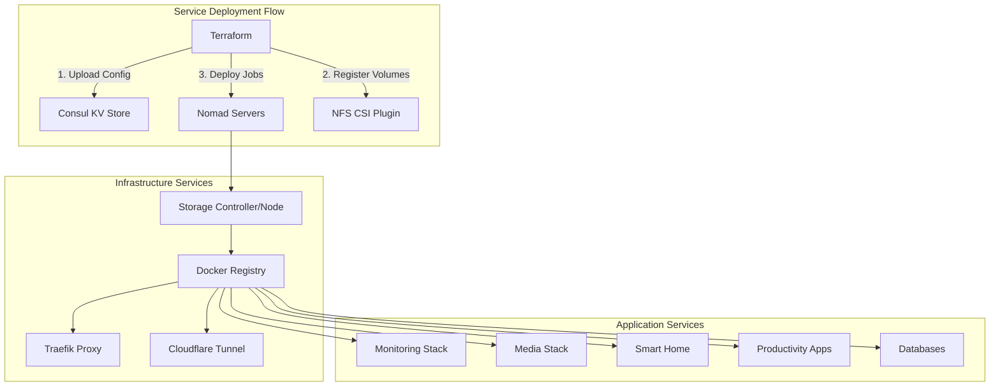
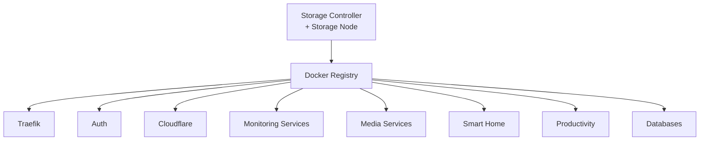

# Services Deployment

This Terraform module deploys and manages containerized services on the Nomad cluster using HashiCorp Nomad job specifications. It handles NFS CSI volume registration, Consul KV configuration, and service orchestration.

## Overview

The services module deploys 40+ containerized applications across multiple categories:

- **Infrastructure**: Storage, networking, container registry
- **Monitoring & Logging**: Metrics collection, dashboards, log aggregation
- **Media Services**: Media servers, download automation (*arr stack)
- **Smart Home**: Home automation, MQTT, Matter controller
- **Productivity**: Password management, wikis, workflow automation
- **Databases**: PostgreSQL, MongoDB, InfluxDB

## Architecture



## Prerequisites

### Cluster Infrastructure

The Nomad/Consul cluster must be deployed and healthy:

```bash
# Verify cluster is running
consul members
nomad node status

# All nodes should show "alive" and "ready" status
```

See [`../cluster/README.md`](../cluster/README.md) for cluster setup.

### NFS Server

An NFS server must be configured and accessible from worker nodes:

- NFS exports created for each service volume
- Network connectivity from workers to NFS server
- Proper permissions (UID 1000 for containers, UID 1010 for media)

### Network Configuration

- DNS resolution working (CoreDNS operational)
- Domain configured for services (e.g., `example.com`)
- Cloudflare tunnel configured (if using Cloudflare for external access)

## Deployed Services

### Infrastructure Services

| Service | Purpose | Port | Job File |
|---------|---------|------|----------|
| **storage-controller** | NFS CSI controller plugin | - | [`nomad_jobs/storage-controller.hcl`](nomad_jobs/storage-controller.hcl) |
| **storage-node** | NFS CSI node plugin | - | [`nomad_jobs/storage-node.hcl`](nomad_jobs/storage-node.hcl) |
| **docker-registry** | Private Docker registry with caching | 5000 | [`nomad_jobs/docker-registry.hcl`](nomad_jobs/docker-registry.hcl) |
| **traefik** | Reverse proxy and ingress controller | 80, 443 | [`nomad_jobs/traefik.hcl`](nomad_jobs/traefik.hcl) |
| **cloudflared** | Cloudflare tunnel for external access | - | [`nomad_jobs/cloudflared.hcl`](nomad_jobs/cloudflared.hcl) |
| **auth** | OAuth forward authentication | 4181 | [`nomad_jobs/auth.hcl`](nomad_jobs/auth.hcl) |

### Monitoring & Logging

| Service | Purpose | Port | Job File |
|---------|---------|------|----------|
| **prometheus** | Metrics collection and storage | 9090 | [`nomad_jobs/prometheus.hcl`](nomad_jobs/prometheus.hcl) |
| **grafana** | Metrics visualization dashboard | 3000 | [`nomad_jobs/grafana.hcl`](nomad_jobs/grafana.hcl) |
| **influxdb** | Time-series database | 8086 | [`nomad_jobs/influxdb.hcl`](nomad_jobs/influxdb.hcl) |
| **telegraf** | Metrics collection agent | - | [`nomad_jobs/telegraf.hcl`](nomad_jobs/telegraf.hcl) |
| **loki** | Log aggregation system | 3100 | [`nomad_jobs/loki.hcl`](nomad_jobs/loki.hcl) |
| **vector** | Log collection and routing | - | [`nomad_jobs/vector.hcl`](nomad_jobs/vector.hcl) |

### Media Services

| Service | Purpose | Port | Job File |
|---------|---------|------|----------|
| **plex** | Media server | 32400 | [`nomad_jobs/plex.hcl`](nomad_jobs/plex.hcl) |
| **jellyfin** | Open-source media server | 8096 | [`nomad_jobs/jellyfin.hcl`](nomad_jobs/jellyfin.hcl) |
| **sonarr** | TV show automation | 8989 | [`nomad_jobs/sonarr.hcl`](nomad_jobs/sonarr.hcl) |
| **radarr** | Movie automation | 7878 | [`nomad_jobs/radarr.hcl`](nomad_jobs/radarr.hcl) |
| **prowlarr** | Indexer manager | 9696 | [`nomad_jobs/prowlarr.hcl`](nomad_jobs/prowlarr.hcl) |
| **sabnzbd** | Usenet download client | 8080 | [`nomad_jobs/sabnzbd.hcl`](nomad_jobs/sabnzbd.hcl) |
| **transmission** | BitTorrent client | 9091 | [`nomad_jobs/transmission.hcl`](nomad_jobs/transmission.hcl) |
| **emulatorjs** | Browser-based game emulator | 3000 | [`nomad_jobs/emulatorjs.hcl`](nomad_jobs/emulatorjs.hcl) |
| **flaresolverr** | Cloudflare bypass for indexers | 8191 | [`nomad_jobs/flaresolverr.hcl`](nomad_jobs/flaresolverr.hcl) |

### Smart Home

| Service | Purpose | Port | Job File |
|---------|---------|------|----------|
| **home-assistant** | Home automation platform | 8123 | [`nomad_jobs/home-assistant.hcl`](nomad_jobs/home-assistant.hcl) |
| **mosquitto** | MQTT message broker | 1883 | [`nomad_jobs/mosquitto.hcl`](nomad_jobs/mosquitto.hcl) |
| **matter** | Matter smart home controller | 5540 | [`nomad_jobs/matter.hcl`](nomad_jobs/matter.hcl) |
| **motioneye** | Video surveillance | 8765 | [`nomad_jobs/motioneye.hcl`](nomad_jobs/motioneye.hcl) |

### Productivity & Utilities

| Service | Purpose | Port | Job File |
|---------|---------|------|----------|
| **vaultwarden** | Password manager (Bitwarden) | 80 | [`nomad_jobs/vaultwarden.hcl`](nomad_jobs/vaultwarden.hcl) |
| **wikijs** | Documentation wiki | 3000 | [`nomad_jobs/wikijs.hcl`](nomad_jobs/wikijs.hcl) |
| **n8n** | Workflow automation | 5678 | [`nomad_jobs/n8n.hcl`](nomad_jobs/n8n.hcl) |
| **drawio** | Diagram editor | 8080 | [`nomad_jobs/drawio.hcl`](nomad_jobs/drawio.hcl) |
| **pgweb** | PostgreSQL web client | 8081 | [`nomad_jobs/pgweb.hcl`](nomad_jobs/pgweb.hcl) |
| **nginx** | Static web server | 80 | [`nomad_jobs/nginx.hcl`](nomad_jobs/nginx.hcl) |
| **samba** | SMB file sharing | 445 | [`nomad_jobs/samba.hcl`](nomad_jobs/samba.hcl) |

### Databases

| Service | Purpose | Port | Job File |
|---------|---------|------|----------|
| **postgres** | PostgreSQL database | 5432 | [`nomad_jobs/postgres.hcl`](nomad_jobs/postgres.hcl) |
| **mongodb8** | MongoDB 8.x database | 27017 | [`nomad_jobs/mongodb8.hcl`](nomad_jobs/mongodb8.hcl) |
| **mongodb7** | MongoDB 7.x database | 27017 | [`nomad_jobs/mongodb7.hcl`](nomad_jobs/mongodb7.hcl) |
| **mongodb6** | MongoDB 6.x database | 27017 | [`nomad_jobs/mongodb6.hcl`](nomad_jobs/mongodb6.hcl) |

### Network & Infrastructure

| Service | Purpose | Port | Job File |
|---------|---------|------|----------|
| **unifi** | UniFi network controller | 8443 | [`nomad_jobs/unifi.hcl`](nomad_jobs/unifi.hcl) |

### Maintenance Jobs

| Service | Purpose | Schedule | Job File |
|---------|---------|----------|----------|
| **docker-cleanup** | Clean unused Docker resources | Daily | [`nomad_jobs/docker-cleanup.hcl`](nomad_jobs/docker-cleanup.hcl) |
| **journalctl-cleanup** | Clean systemd logs | Daily | [`nomad_jobs/journalctl-cleanup.hcl`](nomad_jobs/journalctl-cleanup.hcl) |
| **nomad-cleanup** | Clean old Nomad allocations | Daily | [`nomad_jobs/nomad-cleanup.hcl`](nomad_jobs/nomad-cleanup.hcl) |

## Configuration

### Required Variables

Create `terraform.auto.tfvars` with required secrets and configuration:

```hcl
# Nomad/Consul Connection
nomad_url   = "http://192.168.1.71:4646"
consul_url  = "http://192.168.1.71:8500"
secret_id   = "your-nomad-acl-token"  # If ACLs enabled

# Domain Configuration
domain        = "example.com"
consul_domain = "service.consul"

# Dashboard URLs (for Traefik routing)
pfsense_url     = "https://firewall.example.com"
pve_url         = "https://proxmox.example.com:8006"
pve_backup_url  = "https://pbs.example.com:8007"

# OAuth Authentication (for Traefik forward auth)
auth_domain         = "example.com"
auth_client_id      = "your-oauth-client-id"
auth_client_secret  = "your-oauth-client-secret"
auth_secret         = "random-secret-string"
auth_whitelist_email = "admin@example.com"

# Cloudflare Tunnel
cloudflared_tunnel_token = "your-cloudflare-tunnel-token"

# Grafana
grafana_email    = "admin@example.com"
grafana_password = "secure-password"
grafana_url      = "https://grafana.example.com"

# PostgreSQL
postgres_root_user     = "postgres"
postgres_root_password = "secure-password"

# InfluxDB
influxdb_user     = "admin"
influxdb_password = "secure-password"

# Samba
samba_user = "1000"
samba_name = "share"
samba_pass = "secure-password"

# MongoDB (for UniFi)
mongo_user                 = "unifi"
mongo_password             = "secure-password"
mongo_initdb_root_username = "admin"
mongo_initdb_root_password = "secure-password"
mongo_authsource           = "admin"
mongo_dbname               = "unifi"

# MQTT
mqtt_user     = "mqtt"
mqtt_password = "secure-password"
```

### Consul KV Configuration Files

Configuration files are uploaded to Consul KV store from [`consul_files/`](consul_files/):

| Service | Config File | Purpose |
|---------|-------------|---------|
| Traefik | [`traefik/traefik.yaml`](consul_files/traefik/traefik.yaml) | Main Traefik configuration |
| Traefik | [`traefik/dynamic.yaml`](consul_files/traefik/dynamic.yaml) | Dynamic routing rules |
| Prometheus | [`prometheus/prometheus.yaml`](consul_files/prometheus/prometheus.yaml) | Scrape configurations |
| Loki | [`loki/loki.yaml`](consul_files/loki/loki.yaml) | Loki server config |
| Telegraf | [`telegraf/config.toml`](consul_files/telegraf/config.toml) | Metrics collection config |
| Vector | [`vector/vector.toml`](consul_files/vector/vector.toml) | Log routing config |
| Mosquitto | [`mqtt/mosquitto.conf`](consul_files/mqtt/mosquitto.conf) | MQTT broker config |
| MongoDB | [`init_mongo/init-mongo.sh`](consul_files/init_mongo/init-mongo.sh) | Database initialization |

Managed by [`consul_keys.tf`](consul_keys.tf).

## Usage

### Initialize Terraform

```bash
# From project root
make init-services

# Or manually
cd terraform/services
terraform init
```

Providers used:
- `hashicorp/nomad` v2.5.2
- `hashicorp/consul` v2.22.1

### Plan Deployment

```bash
# From project root
make plan-services

# Or manually
cd terraform/services
terraform plan
```

Review:
- CSI volume registrations
- Consul KV uploads
- Nomad job deployments
- Service dependencies

### Deploy Services

```bash
# From project root
make deploy-services

# Or manually
cd terraform/services
terraform apply
```

**Deployment Order** (managed by `depends_on`):
1. Storage controller and node plugins
2. Docker registry (detach = false, waits for completion)
3. All other services (in parallel)

Total deployment time: 10-15 minutes

### Validate Job Definitions

Before deploying, validate Nomad HCL syntax:

```bash
# From project root
make validate-jobs

# This runs terraform/scripts/validate-jobs.sh
# Validates all .hcl files in nomad_jobs/
```

### Verify Deployment

```bash
# Check all jobs are running
nomad job status

# Check specific job
nomad job status traefik

# View allocations
nomad alloc status <alloc-id>

# Check logs
nomad alloc logs <alloc-id>

# Check CSI volumes
nomad volume status
```

## Service Dependencies



**Critical Dependencies**:
- All services depend on NFS CSI plugins (storage-controller, storage-node)
- All services depend on docker-registry (for caching public images)
- Services use `detach = false` for docker-registry to ensure it's ready

Defined in [`nomad_jobs.tf`](nomad_jobs.tf).

## Storage Architecture

### NFS CSI Plugin

The NFS CSI plugin provides persistent storage for services:

**Controller** ([`nomad_jobs/storage-controller.hcl`](nomad_jobs/storage-controller.hcl)):
- Runs as system job
- Manages volume lifecycle
- Handles volume provisioning

**Node Plugin** ([`nomad_jobs/storage-node.hcl`](nomad_jobs/storage-node.hcl)):
- Runs on all worker nodes (system job)
- Mounts NFS volumes to containers
- Handles volume attachment

### CSI Volume Registration

Volumes are registered in [`volumes.tf`](volumes.tf):

```hcl
resource "nomad_csi_volume_registration" "example" {
  plugin_id   = "nfs"
  volume_id   = "service-name"
  name        = "service-name"
  external_id = "nfs/path/on/server"

  capability {
    access_mode     = "multi-node-multi-writer"
    attachment_mode = "file-system"
  }

  lifecycle {
    prevent_destroy = true  # Protect data
  }
  depends_on = [nomad_job.storage-controller]
}
```

**Access Modes**:
- `multi-node-multi-writer`: Volume can be mounted on multiple nodes simultaneously
- `file-system`: NFS file system (vs block device)

**Lifecycle Protection**:
- `prevent_destroy = true` prevents accidental volume deletion
- Must be manually removed from state before terraform destroy

### Registered Volumes

Complete list of CSI volumes (40+ volumes):

| Volume ID | External Path | Service |
|-----------|---------------|---------|
| grafana | grafana | Grafana |
| plex | plex | Plex |
| jellyfin | jellyfin | Jellyfin |
| sonarr | sonarr | Sonarr |
| radarr | radarr | Radarr |
| prowlarr | prowlarr | Prowlarr |
| sabnzbd | sabnzbd | SABnzbd |
| transmission | transmission | Transmission |
| hass | hass | Home Assistant |
| postgres | postgres | PostgreSQL |
| mongo | mongo | MongoDB |
| vaultwarden | vaultwarden | Vaultwarden |
| wikijs | wikijs | Wiki.js |
| n8n | n8n | n8n |
| media | media | Media files |
| media-downloads | media/downloads | Download temp |
| certs | certs | SSL certificates |
| ... | ... | ... |

See [`volumes.tf`](volumes.tf) for complete list.

## Networking

### Traefik Reverse Proxy

Traefik handles all HTTP(S) traffic:

**Features**:
- Automatic service discovery via Consul
- Let's Encrypt SSL certificates
- HTTP to HTTPS redirect
- Forward authentication integration
- Access logs

**Configuration**:
- Static config: [`consul_files/traefik/traefik.yaml`](consul_files/traefik/traefik.yaml)
- Dynamic routes: [`consul_files/traefik/dynamic.yaml`](consul_files/traefik/dynamic.yaml)

**Service Tags** (in Nomad jobs):
```hcl
tags = [
  "traefik.enable=true",
  "traefik.http.routers.myapp.rule=Host(`myapp.example.com`)",
  "traefik.http.routers.myapp.entrypoints=websecure",
  "traefik.http.routers.myapp.tls.certresolver=letsencrypt"
]
```

### Service Discovery

Services register with Consul automatically via Nomad:
- Service name: Defined in job spec
- Health checks: HTTP/TCP probes
- Tags: Traefik routing configuration
- Connect: Service mesh (optional)

### DNS Resolution

- Internal: `service-name.service.consul` (via CoreDNS)
- External: `service-name.example.com` (via Traefik)

## File Structure

```
terraform/services/
├── consul_keys.tf         # Consul KV configuration uploads
├── nomad_jobs.tf          # Nomad job resource definitions
├── nomad_vars.tf          # Nomad variable blocks (secrets injection)
├── providers.tf           # Terraform provider configuration
├── scheduler.tf           # Nomad scheduler configuration
├── variables.tf           # Input variable definitions
├── volumes.tf             # CSI volume registrations
├── consul_files/          # Configuration files for Consul KV
│   ├── traefik/
│   ├── prometheus/
│   ├── loki/
│   ├── telegraf/
│   ├── vector/
│   ├── mqtt/
│   └── init_mongo/
└── nomad_jobs/            # Nomad job HCL files
    ├── auth.hcl
    ├── traefik.hcl
    ├── grafana.hcl
    ├── plex.hcl
    └── ... (40+ job files)
```

## Managing Services

### Updating a Service

To update a job configuration:

1. Edit the job file:
```bash
vim nomad_jobs/grafana.hcl
```

2. Validate syntax:
```bash
make validate-jobs
```

3. Plan and apply:
```bash
make plan-services
make deploy-services
```

Nomad will perform rolling updates based on job's update stanza.

### Stopping a Service

```bash
# Via Nomad CLI
nomad job stop grafana

# Or comment out in nomad_jobs.tf and apply
```

### Removing a Service

1. Remove from [`nomad_jobs.tf`](nomad_jobs.tf)
2. Remove associated volume from [`volumes.tf`](volumes.tf) (if applicable)
3. Apply changes:
```bash
terraform apply
```

### Scaling a Service

Edit the job file's count parameter:

```hcl
group "myapp" {
  count = 3  # Scale to 3 instances

  # ...
}
```

Then apply:
```bash
make deploy-services
```

## Troubleshooting

### Job Validation Failed

**Symptom**: `make validate-jobs` reports errors.

**Fix**:
```bash
# Validate specific job
nomad job validate nomad_jobs/grafana.hcl

# Common issues:
# - Missing closing braces
# - Invalid interpolation syntax
# - Undefined variables
```

### Job Won't Start

**Check allocation status**:
```bash
nomad job status service-name
nomad alloc status <alloc-id>
nomad alloc logs <alloc-id>
```

**Common causes**:
- Volume mount failure (CSI plugin not running)
- Port conflict (port already in use)
- Resource constraints (insufficient CPU/RAM)
- Image pull failure (registry unreachable)
- Health check failing

### Volume Mount Failures

**Symptom**: Job fails with volume attachment errors.

**Check CSI plugins**:
```bash
# Verify plugins are running
nomad job status storage-controller
nomad job status storage-node

# Check volume status
nomad volume status volume-name

# Verify NFS server is accessible
showmount -e nfs-server-ip
```

**Fix**:
```bash
# Restart CSI plugins
nomad job stop storage-controller
nomad job stop storage-node
terraform apply  # Redeploy
```

### Service Not Accessible

**Symptom**: Can't reach service at expected URL.

**Check Traefik**:
```bash
# View Traefik dashboard
# https://traefik.example.com

# Check Traefik logs
nomad job status traefik
nomad alloc logs <traefik-alloc-id>

# Verify service registration in Consul
consul catalog services
consul catalog nodes -service=service-name
```

**Common causes**:
- Service not registered in Consul (health check failing)
- Traefik tags misconfigured
- DNS not resolving
- Firewall blocking traffic

### Docker Registry Issues

**Symptom**: Services can't pull images.

**Check registry**:
```bash
nomad job status docker-registry

# Test registry connectivity from worker
curl http://docker-registry.service.consul:5000/v2/
```

**Fix**:
```bash
# Restart registry
nomad job stop docker-registry
terraform apply
```

### Terraform State Drift

**Symptom**: Terraform wants to recreate resources.

**Check what changed**:
```bash
terraform plan -detailed-exitcode
terraform show
```

**Common causes**:
- Job file modified outside Terraform
- Manual nomad job run commands
- Nomad server state inconsistent

**Fix**:
```bash
# Refresh state
terraform refresh

# Or reimport resource
terraform import nomad_job.service-name service-name
```

## Backup Strategy

### Critical Data

**What to backup**:
- Terraform state (`terraform.tfstate`)
- Variable files (`*.auto.tfvars`)
- Nomad job files (`nomad_jobs/*.hcl`)
- Consul KV data
- NFS volumes (service data)

### Backup Procedures

**Terraform State**:
```bash
cp terraform.tfstate terraform.tfstate.backup.$(date +%Y%m%d)
```

**Consul KV**:
```bash
consul kv export > consul-backup.json
```

**Nomad Jobs**:
```bash
# Already in git repository
git add nomad_jobs/
git commit -m "Backup job definitions"
```

**NFS Volumes**:
```bash
# On NFS server
rsync -av /nfs/exports/ /backup/nfs/$(date +%Y%m%d)/
```

## Security Considerations

### Secrets Management

- **Never commit secrets** to version control
- Use `*.auto.tfvars` for secrets (gitignored)
- Consider using Vault for secret injection
- Rotate credentials regularly

### Network Security

- **Traefik Authentication**: Use forward auth for admin interfaces
- **Service Isolation**: Services communicate via Consul service mesh
- **SSL/TLS**: Let's Encrypt certificates via Traefik
- **Firewall**: Worker nodes should only allow cluster traffic

### Access Control

- **Nomad ACLs**: Enable for production deployments
- **Consul ACLs**: Enable for production deployments
- **Container Users**: Services run as non-root (UID 1000/1010)

## Maintenance

### Regular Tasks

**Weekly**:
- Review failed jobs: `nomad job status`
- Check disk usage on NFS server
- Review Traefik access logs

**Monthly**:
- Update container images
- Review and clean old allocations
- Audit failed health checks

**Quarterly**:
- Update Nomad job definitions
- Review resource allocations
- Update Consul KV configurations

### Updating Container Images

Services use specific image tags. To update:

1. Edit job file with new image tag
2. Validate and apply:
```bash
make validate-jobs
make deploy-services
```

Nomad performs rolling updates automatically.

## Performance Tuning

### Resource Allocation

Review resource usage:
```bash
# Node resource availability
nomad node status -verbose

# Job resource usage
nomad alloc status <alloc-id>
```

Adjust in job files:
```hcl
resources {
  cpu    = 500   # MHz
  memory = 1024  # MB
}
```

### Job Placement

Control job placement using constraints:
```hcl
constraint {
  attribute = "${node.unique.name}"
  value     = "worker01"
}
```

Or affinities for soft preferences.

## Related Documentation

- **Project Root**: [`../../README.md`](../../README.md)
- **Cluster Infrastructure**: [`../cluster/README.md`](../cluster/README.md)
- **Makefile Commands**: [`../../Makefile`](../../Makefile)

## Resources

- [HashiCorp Nomad Jobs](https://www.nomadproject.io/docs/job-specification)
- [Nomad CSI Plugins](https://www.nomadproject.io/docs/internals/plugins/csi)
- [Consul KV Store](https://www.consul.io/docs/dynamic-app-config/kv)
- [Traefik Documentation](https://doc.traefik.io/traefik/)
- [Docker Registry](https://docs.docker.com/registry/)
